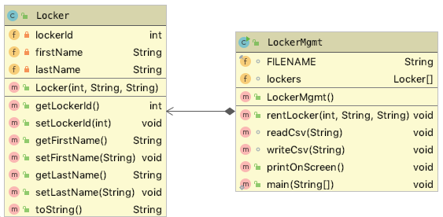

# Spindverwaltung

## Aufgabenstellung

An der HTL Leonding können die Schüler Spinde (im engl. locker) mieten. Es gibt derzeit 100 Spinde, die von 1 - 100 nummeriert sind. 

Die Spinde können von Schülern gemietet werden. Dabei muss von den Schülern Vor- und Nachname angegeben werden, um einen Spind mieten zu können. Die Nr des Spinds (lockerId) darf von den Schülern frei gewählt werden.

Die Datei `locker.csv` enthält folgende Informationen:

- lockerId
- firstName 
- lastName

Der Inhalt der Datei `locker.csv` könnte wie folgt aussehen:

```
3;Max;Mustermann
5;Mimi;Musterfrau
15;Susi;Super
```

Das Programm besteht aus den Klassen Locker.java (`lockerId`, `firstName`, `lastName`) und `LockerMgmt.java`.



- In der Klasse `LockerMgmt` gibt es ein Array `lockers` mit 100 Elementen. Jeder Spind entspricht genau einem Element in diesem Array. Ist ein Element leer, so ist der Spind noch nicht vermietet. Jeder Schüler, der einen Spind mieten möchte kann sich diesen aussuchen. Allerdings wird überprüft, ob dieser Spind bereits vergeben ist. Wenn ja, wird die RuntimeException `LockerNotAvailableException` mit der Message `Locker 3: Max Mustermann already occupied` geworfen.

- Erstellen Sie in `LockerMgmt` eine Methode `rentLocker(lockerId, firstName, lastName)` mit der ein Spind reserviert werden kann.

- Erstellen Sie eine Methode `writeCsv(String filename)` zum Schreiben der csv-Datei.

- Erstellen Sie eine Methode `readCsv(String filename)` zum Einlesen der csv-Datei.

- Erstellen Sie eine Methode `prinOnScreen()` zuur Ausgabe der Spinde am Bildschirm.

- Schreiben Sie geeignete Unittests, um die verschiedenen Fälle zu prüfen
  -  Spind kann reserviert werden
  -  Spind ist bereits vergeben
  -  lockerId ist nicht im Bereich zwischen 1 und 100
  -  ein oder mehrere Parameter ist/sind null
  -  Schreiben der CSV-Datei
  -  Lesen der CSV-Datei
  -  ...

- Erstellen Sie eine main-Methode in `LockerMgmt` in der mit einer Eingabeschleife mehrere Spinde vergeben werden können. Wird die Eingabeschleife beendet, werden die vergebenen Spinde in der Datei `locker.csv`gespeichert und die vergebenen Spinde am Bildschirm ausgegeben.

  Pseudocode von main():
  - Einlesen der csv-Datei
  - Ausgeben der Spinde am Bildschirm
  - Eingabe neuer Vermietungen von Spinden
  - Ausgeben der Spindvermietungen
  - Schreiben der csv-Datei

## Bildschirmausgabe
  
```
Spinde aus Datei 'locker.csv' eingelesen

Folgende Spinde sind reserviert: 
Locker  3: Max Mustermann
Locker  5: Mimi Musterfrau
Locker 15: Susi Super
	
Möchten Sie einen weiteren Spind reservieren? (y/n): y
	
Spind-Nummer : 3
Vorname      : Karl
Nachname     : Klug
FEHLER: Locker 3: Karl Klug already occupied
	
Möchten Sie einen weiteren Spind reservieren? (y/n): y
	
Spind-Nummer : 4
Vorname      : Karl
Nachname     : Klug
Möchten Sie einen weiteren Spind reservieren? (y/n): y
	
Spind-Nummer : 71
Vorname      : Emil
Nachname     : Einzigartig
Möchten Sie einen weiteren Spind reservieren? (y/n): y
	
Spind-Nummer : 72
Vorname      : 
Nachname     : Fröhlich
FEHLER: firstName is null or empty
Möchten Sie einen weiteren Spind reservieren? (y/n): n
	
Folgende Spinde sind reserviert: 
Locker  3: Max Mustermann
Locker  4: Karl Klug
Locker  5: Mimi Musterfrau
Locker 15: Susi Super
Locker 71: Emil Einzigartig
	
Daten in Datei 'locker.csv' gespeichert
```

Beachten Sie auf die Verwendung der korrekten Packages und Bezeichnungen.

## Viel Erfolg!


